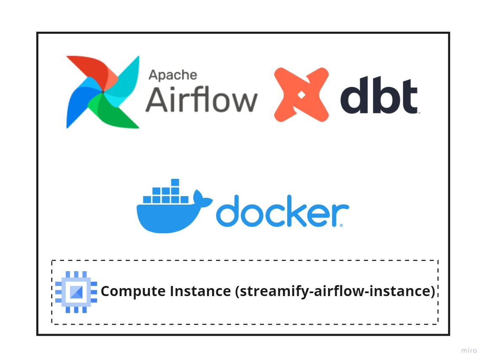
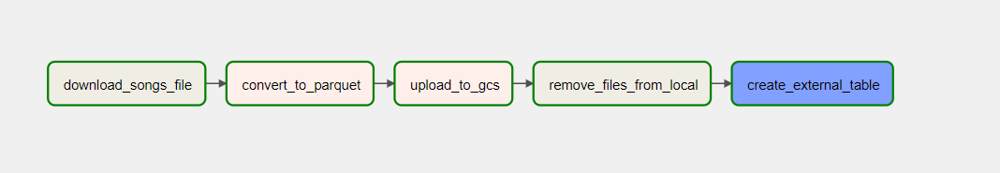
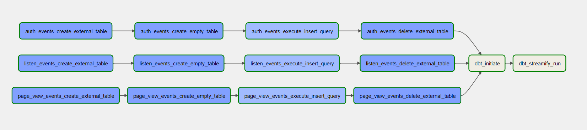
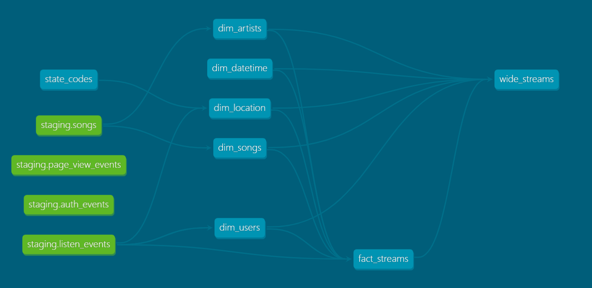

## Setup Airflow VM



We will setup airflow on docker in a dedicated compute instance. dbt is setup inside airflow.

- Establish SSH connection

  ```bash
  ssh streamify-airflow
  ```

- Clone git repo

  ```bash
  git clone https://github.com/ankurchavda/streamify.git && \
  cd streamify
  ```
- Install anaconda, docker & docker-compose.

  ```bash
  bash ~/streamify/scripts/vm_setup.sh && \
  exec newgrp docker
  ```
- Move the service account json file from local to the VM machine in `~/.google/credentials/` directory.  Make sure it is named as `google_credentials.json`  else the dags will fail!

  - You can use [sftp](https://youtu.be/ae-CV2KfoN0?t=2442) to transfer the file.

- Set the evironment variables (same as Terraform values)-

  - GCP Project ID

  - Cloud Storage Bucket Name

    ```bash
    export GCP_PROJECT_ID=project-id
    export GCP_GCS_BUCKET=bucket-name
    ```

    **Note**: You will have to setup these env vars every time you create a new shell session.

- Start Airflow. (This shall take a few good minutes, grab a coffee!)

  ```bash
  bash ~/streamify/scripts/airflow_startup.sh && cd ~/streamify/airflow
  ```

- Airflow should be available on port `8080` a couple of minutes after the above setup is complete. Login with default username & password as **airflow**.

- Airflow will be running in detached mode. To see the logs from docker run the below command

  ```bash
  docker-compose --follow
  ```

- To stop airflow

  ```bash
  docker-compose down
  ```

### DAGs

The setup has two dags
- `load_songs_dag`
  - Trigger first and only once to load a onetime song file into BigQuery


- `streamify_dag`
  - Trigger after `load_songs_dag` to make sure the songs table table is available for the transformations
  - This dag will run hourly at the 5th minute and perform transformations to create the dimensions and fact.


  - DAG Flow -
    - We first create an external table for the data that was received in the past hour.
    - We then create an empty table to which our hourly data will be appended. Usually, this will only ever run in the first run.
    - Then we insert or append the hourly data, into the table.
    - And then, delete the external table.
    - Finally, run the dbt transformation, to create our dimensions and facts.

### dbt

The transformations happen using dbt which is triggered by Airflow. The dbt lineage should look something like this -



Dimensions:
- `dim_artists`
- `dim_songs`
- `dim_datetime`
- `dim_location`
- `dim_users`

Facts:
- `fact_streams`
  - Partitioning:
    - Data is partitioned on the timestamp column by hour to provide faster data updates for a dashboard that shows data for the last few hours.

Finally, we create `wide_stream` view to aid dashboarding.