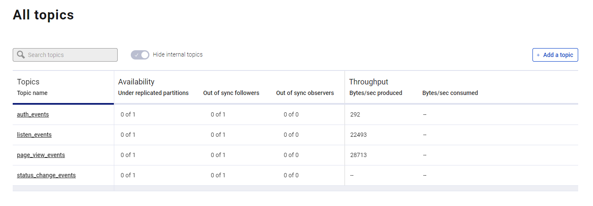

## Setup Kafka VM


We will setup Kafka and eventsim in two separate docker processes in a dedicated compute instance. Eventsim will communicate with port `9092` of the `broker` container of Kafka to send events.

- Establish SSH connection

  ```bash
  ssh streamify-kafka
  ```

- Clone git repo and cd into Kafka folder

  ```bash
  git clone https://github.com/ankurchavda/streamify.git && \
  ```

- Install anaconda, docker & docker-compose.

  ```bash
  bash ~/streamify/scripts/vm_setup.sh && \
  exec newgrp docker
  ```

- Set the evironment variables -

  - External IP of the Kafka VM

    ```bash
    export KAFKA_ADDRESS=IP.ADD.RE.SS
    ```

     **Note**: You will have to setup these env vars every time you create a new shell session. Or if you stop/start your VM

- Start Kafka 

  ```bash
  cd ~/streamify/kafka && \
  docker-compose build && \
  docker-compose up 
  ```

  **Note**: Sometimes the `broker` & `schema-registry` containers die during startup. You should just stop all the containers with `docker-compose down` and then rerun `docker-compose up`.

- The Kafka Control Center should be available on port `9021`. Open and check if everything is working fine.

- Open another terminal session for the Kafka VM and start sending messages to your Kafka broker with Eventsim

  ```bash
  bash ~/streamify/scripts/eventsim_startup.sh
  ```

  This will start creating events for 1 Million users spread out from the current time to the next 24 hours. 
  The container will run in detached mode. Follow the logs to see the progress.

- To follow the logs

  ```bash
  docker logs --follow million_events
  ```

- The messages should start flowing-in in a few minutes.
  
- You should see four topics -

  - listen_events
  - page_view_events
  - auth_events
  - status_change_events
  

- **Note:** If you happen to re-rerun the evenstim container and face the following error -
  
  >docker: Error response from daemon: Conflict. The container name "/million_events" is already in use by container
  
  then run the below command
  ```bash
  docker system prune
  ```