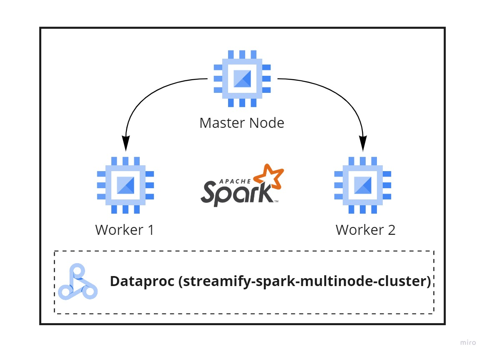

## Setup Spark Cluster



We will start the Spark Streaming process in the DataProc cluster we created to communicate with the Kafka VM instance over the port `9092`. Remember, we opened port 9092 for it to be able to accept connections.

- Establish SSH connection to the **master node**

  ```bash
  ssh streamify-spark
  
- Clone git repo

  ```bash
  git clone https://github.com/ankurchavda/streamify.git && \
  cd streamify/spark_streaming
  ```

- Set the evironment variables -

  - External IP of the Kafka VM so that spark can connect to it

  - Name of your GCS bucket. (What you gave during the terraform setup)

    ```bash
    export KAFKA_ADDRESS=IP.ADD.RE.SS
    export GCP_GCS_BUCKET=bucket-name
    ```

     **Note**: You will have to setup these env vars every time you create a new shell session. Or if you stop/start your cluster

- Start reading messages

  ```bash
  spark-submit \
  --packages org.apache.spark:spark-sql-kafka-0-10_2.12:3.1.2 \
  stream_all_events.py
  ```

- If all went right, you should see new `parquet` files in your bucket! That is Spark writing a file every two minutes for each topic.

- Topics we are reading from

  - listen_events
  - page_view_events
  - auth_events